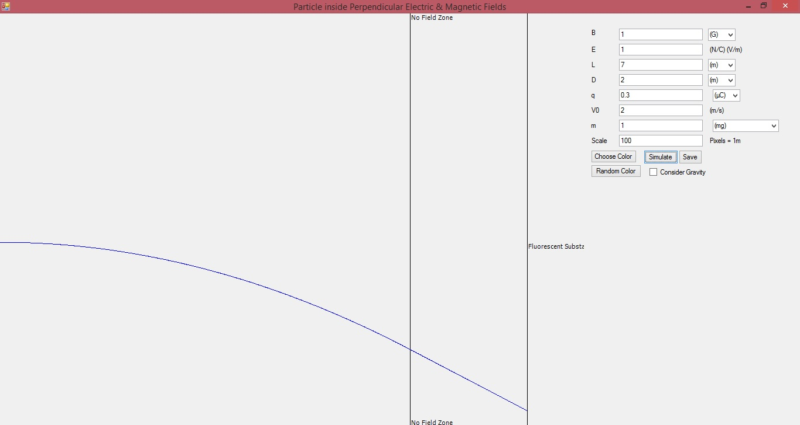
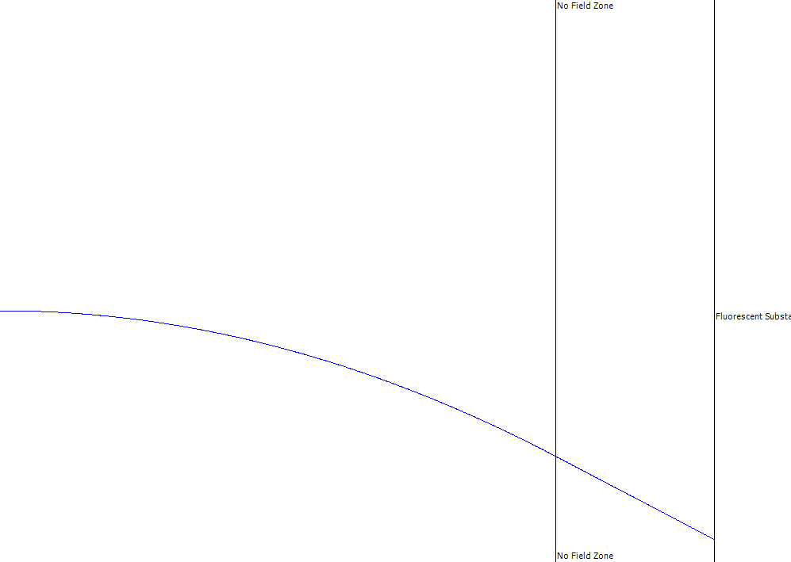

# Particle Trajectory Simulator
This app simulates the trajectory of a charged particle inside an electric and a magnetic field.  
   
The electric field is along the height of the screen and the magnetic field is perpendicular to the screen.
